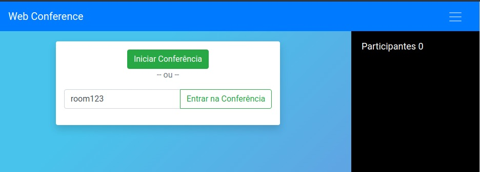

 ## WebRTC ShareScreen Demo

Demo and testing application with ONE-TO-MANY screen sharing using WebRTC



The application consists of two modules:

### App-UI

- Developed in React and using RTCMultiConnection

### Server:

- Node.JS + Socket.IO server - Signaling server 


## Running 

```bash
# Start UI (port 3000)
cd app-ui
npm start

# Start Server (port 9001)
cd server 
npm start
```

TIP: Testing in other PC using HTTPS

```bash
npm install -g localtunnel
lt --port 8000
```


## License

This project is released under [MIT licence](https://github.com/muaz-khan/RTCMultiConnection/blob/master/LICENSE.md) . Copyright (c) Ricardo JL Rufino.